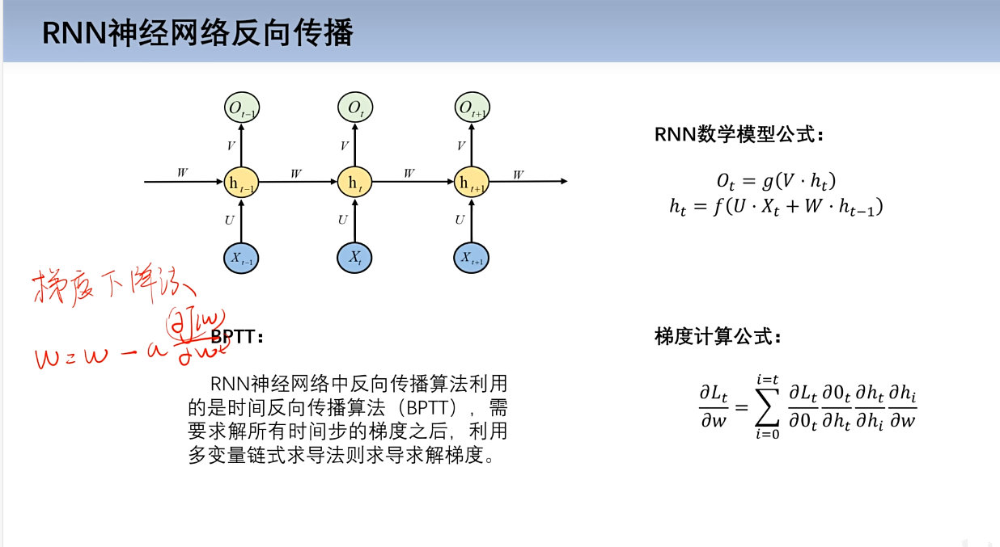

# 深度学习

## 一、线性回归模型

**y=wx+b**

### 线性回归模型参数求解：

①穷举法

②最小二乘法

求极值，令偏导数为0

**⭐③梯度下降法**

核心：找到正确的方向

## 二、逻辑回归模型

逻辑回归算法的原理：

(1)参数w更新（交叉熵损失函数）:

（2）参数b更新：

评价指标（P:postive,N:negative）：

准确率：(TP+TN)/(TP+TN+FP+FN)

精确率：P = TP/(TP+FP)

召回率：召回=TP/(TP+FN)

F1值（精确率和召回率的调和均值）：2TP/(2TP+FP+FN)

## 三、全连接神经网络

神经元的数学表达式：

a = h(w*x+b)（h：为激活函数，非线性）

### 激活函数

作用：提供神经网络效率，神经网络隐藏层越深，效果越好

（1）Sigmoid函数

（2）Tanh函数

（3）ReLU函数

（4）Leaky ReLU函数

### 损失函数

### 卷积层

**⭐输出特征图大小计算公式（有小数就向下取整）**：

P：填充大小 S：步幅

### 池化层

最大池化：找最大值

平均池化：找平均值

卷积神经网络整体结构：

### LeNet和原理与实战

特征提取部分和全连接层

### AlexNet

LRN正则化：对局部的值进行归一化操作，使其中比较大的值变得相对更大，增强了局部的对比度。

## 模型训练过程

#### 1、收集数据，数据预处理

#### 2、搭建模型

#### 3、开始训练：学习率，学习训练伦次等参数

##### 3.1、前向传播

##### 3.2、计算误差

##### 3.3、反向传播（梯度下降法）

##### 3.4、直到训练伦次结束

##### 3.5、产生model（w，b更新完毕）

#### 4、开始测试

#### 5、应用

## RNN循环神经网络

## LSTM模型

LSTM（长短时记忆网络）是一种常用于处理序列数据的深度学习模型，与传统的 RNN（循环神经网络）相比，LSTM引入了三个门（ **输入门、遗忘门、输出门**，如下图所示）和一个 ***细胞状态\***（cell state），这些机制使得LSTM能够更好地处理序列中的长期依赖关系。

## GRU模型

### 一、定义

GRU（Gate Recurrent Unit）是循环神经网络（[RNN](https://so.csdn.net/so/search?q=RNN&spm=1001.2101.3001.7020)）的一种，可以解决RNN中不能长期记忆和反向传播中的梯度等问题，与LSTM的作用类似，不过比LSTM简单，容易进行训练。
